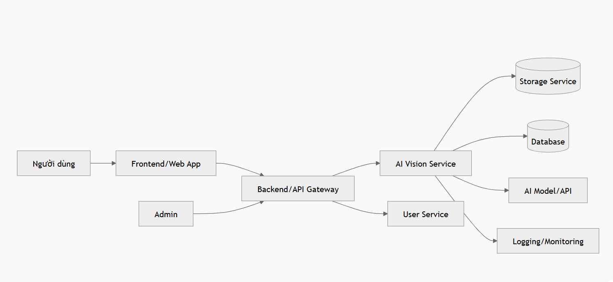
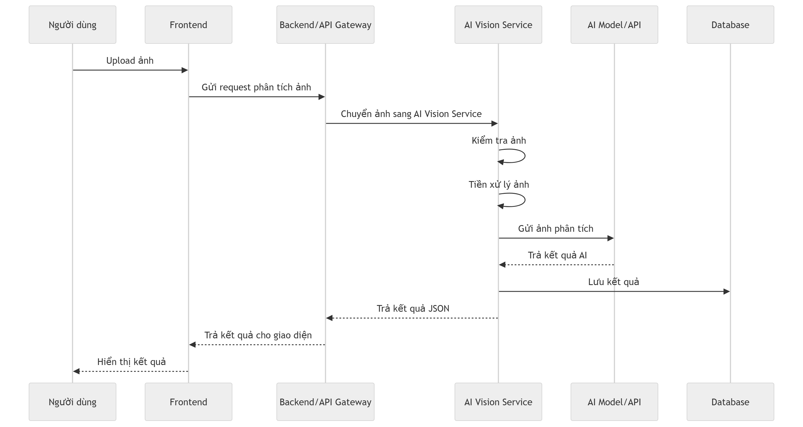

# Service Boundary của nhóm

## 1. Thông tin nhóm

- Tên nhóm: 4a
- Lớp: CNTT 17-10
- Thành viên:
  - Lê Thị Thương
  - Trần Hải Linh
  - Trần Thị Thùy Linh
- Service nhóm phụ trách: AI Vision Service
- Sản phẩm tổng thể của lớp: Hệ thống dịch vụ thông minh hỗ trợ người dùng phân tích và xử lý dữ liệu bằng AI

---

## 2. Actor

Các actor tương tác với hệ thống/service gồm:

- Người dùng cuối:
  - Tải ảnh lên hệ thống.
  - Yêu cầu AI phân tích nội dung trong ảnh.
  - Xem kết quả phân tích ảnh.

- Frontend/Web App:
  - Gửi ảnh và yêu cầu phân tích đến AI Vision Service.
  - Hiển thị kết quả trả về cho người dùng.

- Backend chính/API Gateway:
  - Nhận yêu cầu từ frontend.
  - Chuyển tiếp ảnh hoặc đường dẫn ảnh đến AI Vision Service.
  - Nhận kết quả từ AI Vision Service để trả về frontend.

- Admin/Quản trị viên:
  - Theo dõi trạng thái hoạt động của service.
  - Kiểm tra log, lỗi và hiệu năng xử lý ảnh.

---

## 3. System Boundary

### Nhóm em xây phần nào?

Nhóm xây dựng **AI Vision Service**, là service chuyên xử lý và phân tích hình ảnh bằng trí tuệ nhân tạo.

Service này nhận ảnh từ hệ thống, xử lý ảnh, gọi mô hình AI hoặc thư viện AI để phân tích, sau đó trả về kết quả cho hệ thống chính.

### Phần nhóm kiểm soát

- Xây dựng API cho AI Vision Service.
- Nhận ảnh đầu vào từ người dùng hoặc hệ thống khác.
- Kiểm tra định dạng ảnh.
- Tiền xử lý ảnh trước khi phân tích.
- Gọi mô hình AI để phân tích hình ảnh.
- Trả về kết quả phân tích ảnh.
- Lưu lịch sử phân tích nếu cần.
- Xử lý lỗi khi ảnh sai định dạng, ảnh quá lớn hoặc AI không phân tích được.
- Cung cấp API kiểm tra trạng thái service.

### Phần nhóm chỉ tích hợp

- Tích hợp với Frontend/Web App để nhận ảnh.
- Tích hợp với Backend chính hoặc API Gateway.
- Tích hợp với Storage Service nếu ảnh được lưu trên cloud hoặc server.
- Tích hợp với User Service nếu cần xác thực người dùng.
- Tích hợp với AI Model/API bên ngoài nếu không tự huấn luyện mô hình.
- Tích hợp với Logging/Monitoring Service để ghi log và theo dõi lỗi.

---

## 4. Service Boundary

### Service của nhóm có trách nhiệm gì?

AI Vision Service có các trách nhiệm chính sau:

- Nhận ảnh đầu vào từ hệ thống.
- Kiểm tra ảnh có hợp lệ hay không.
- Hỗ trợ các định dạng ảnh phổ biến như JPG, PNG, JPEG.
- Tiền xử lý ảnh:
  - Resize ảnh.
  - Chuẩn hóa kích thước.
  - Kiểm tra dung lượng ảnh.
  - Chuyển đổi định dạng nếu cần.
- Phân tích nội dung ảnh bằng AI.
- Nhận diện đối tượng trong ảnh.
- Mô tả nội dung ảnh.
- Phân loại ảnh theo danh mục.
- Trích xuất thông tin cơ bản từ ảnh nếu có.
- Trả về kết quả phân tích dưới dạng JSON.
- Lưu kết quả phân tích vào database nếu hệ thống yêu cầu.
- Ghi log quá trình xử lý để dễ kiểm tra lỗi.
- Cung cấp API `/health` để kiểm tra service còn hoạt động hay không.

### Service KHÔNG làm gì?

AI Vision Service không chịu trách nhiệm:

- Không quản lý tài khoản người dùng.
- Không đăng nhập, đăng ký người dùng.
- Không xây dựng giao diện người dùng.
- Không thanh toán.
- Không quản lý toàn bộ hệ thống.
- Không lưu trữ ảnh lâu dài nếu đã có Storage Service riêng.
- Không tự quyết định quyền truy cập của người dùng.
- Không xử lý các nghiệp vụ không liên quan đến phân tích hình ảnh.
- Không thay thế Backend chính/API Gateway.
- Không trực tiếp gửi thông báo cho người dùng nếu hệ thống có Notification Service riêng.

---

## 5. Input / Output

### Input

AI Vision Service nhận các dữ liệu đầu vào sau:

- File ảnh do người dùng tải lên.
- Đường dẫn ảnh nếu ảnh đã được lưu trên Storage Service.
- ID người dùng nếu cần lưu lịch sử phân tích.
- Loại yêu cầu phân tích, ví dụ:
  - Nhận diện đối tượng.
  - Mô tả ảnh.
  - Phân loại ảnh.
  - Kiểm tra nội dung ảnh.
- Metadata của ảnh nếu có:
  - Tên file.
  - Kích thước file.
  - Định dạng ảnh.
  - Thời gian tải lên.

Ví dụ input JSON:

```json
{
  "userId": "U001",
  "imageUrl": "https://storage.example.com/images/image01.jpg",
  "analysisType": "object_detection"
}

### Output

AI Vision Service trả về kết quả phân tích ảnh dưới dạng JSON.

Kết quả trả về có thể bao gồm:

- Trạng thái xử lý.
- Mã phản hồi.
- Nội dung mô tả ảnh.
- Danh sách đối tượng được phát hiện.
- Độ chính xác (confidence score).
- Thời gian xử lý.
- Thông báo lỗi nếu có.

### Ví dụ Output thành công

```json
{
  "status": "success",
  "message": "Image analyzed successfully",
  "data": {
    "description": "Ảnh chứa một người đang sử dụng máy tính.",
    "objects": [
      {
        "label": "person",
        "confidence": 0.96
      },
      {
        "label": "computer",
        "confidence": 0.91
      }
    ],
    "analysisTime": "1.2s"
  }
}

## 6. API dự kiến

Method	Endpoint	Mục đích
GET	/health	Kiểm tra trạng thái hoạt động của service
POST	/api/vision/analyze	Phân tích ảnh tổng quát
POST	/api/vision/detect-objects	Nhận diện đối tượng trong ảnh
POST	/api/vision/classify	Phân loại ảnh
POST	/api/vision/describe	Tạo mô tả nội dung ảnh
GET	/api/vision/history/{userId}	Lấy lịch sử phân tích ảnh
GET	/api/vision/result/{resultId}	Lấy kết quả phân tích theo ID
DELETE	/api/vision/result/{resultId}	Xóa kết quả phân tích

## 7. Phụ thuộc service khác

## Service này gọi đến service nào?

AI Vision Service có thể gọi đến các service sau:

### 1. User Service

Chức năng:

- Xác thực người dùng.
- Kiểm tra quyền truy cập.
- Xác minh thông tin tài khoản khi gửi yêu cầu phân tích ảnh.

### 2. Storage Service

Chức năng:

- Lưu ảnh người dùng tải lên.
- Lấy ảnh từ hệ thống lưu trữ để phân tích.
- Quản lý đường dẫn và dữ liệu ảnh.

### 3. AI Model/API

Chức năng:

- Gửi ảnh đến mô hình AI để xử lý.
- Nhận kết quả phân tích ảnh.
- Thực hiện nhận diện đối tượng, mô tả ảnh và phân loại ảnh.

### 4. Database Service

Chức năng:

- Lưu lịch sử phân tích ảnh.
- Lưu kết quả phân tích.
- Quản lý dữ liệu phục vụ tra cứu kết quả.

### 5. Logging/Monitoring Service

Chức năng:

- Ghi log hệ thống.
- Theo dõi lỗi và hiệu năng xử lý.
- Giám sát trạng thái hoạt động của service.

---

## Service nào gọi đến service này?

### 1. Frontend/Web App

Chức năng:

- Gửi ảnh lên hệ thống để phân tích.
- Nhận và hiển thị kết quả phân tích cho người dùng.

### 2. Backend chính / API Gateway

Chức năng:

- Nhận request từ frontend.
- Chuyển tiếp request đến AI Vision Service.
- Quản lý luồng xử lý giữa các service trong hệ thống.

### 3. Admin Service

Chức năng:

- Kiểm tra trạng thái hoạt động của AI Vision Service.
- Xem thống kê, log và lịch sử xử lý ảnh.
- Theo dõi hiệu năng hệ thống.

## 8. Sơ đồ minh họa

### Sơ đồ kiến trúc service



### Sơ đồ luồng xử lý

